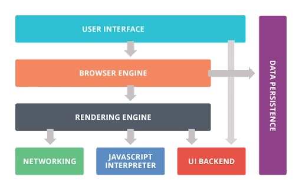

# How the browser works

- The browser is almost a full-blown OS
- The browser has two main missions
  - Display data
  - Allow you to interact with data

## 1. Architecture | Browser Components

### 1. UI (address bar, back/forward buttons): Address bar, navigation controls, tabs

- Handles all user input (URL entry, clicks) and displays output (page view, status indicators)
- Manages window- and tab-level state (e.g. history stack, bookmarks)

### 2. Browser engine (coordinator):

- Acts as a glue between UI and rendering
- Receives UI commands (e.g. "load URL") and orchestrates: networking, parsing, layout, scripting, paiting

### 3. Rendering engine (parses HTML/CSS/JS): Composed of networking, HTML/CSS Parsing and painting, JS engine

- Responsible for HTML and CSS
- Most of the rendering engines are written in C++
- Most popular rendering engines are:

  - Blink: Chrome, Edge, Opera. Based on Webkit
  - WebKit: Safari
  - Gecko: Mozilla

### 3.0 Basic rendering engine flow

- Parsing -> Render tree -> Layout -> Paint

  - Parsing: Translating a docucument into a structure that code can use

    - Grammar

      - vocabulary: keyterms
      - syntax rules: how vocabulary interacts
      - Lexical analysis
      - Syntax analysis
      - Lexer (Tokenizer): create tokens
      - Parser: applies syntax rules
        - Existing Parses: Flex, Lex, Yacc, Bison

    - Types of parser

      - Conventional
        - CSS and JS
      - Unconventional
        - HTML

  - Render Tree

    - Generated while DOM tree is constructed
    - Visual elements in the order which they're going to be displayed
    - Elements in the render tree are called renderer/render objects
      - These objects are literally rectangles
    - Switch case if DOM element needs to be displayed and how
      - Render none, inline, block, inline-block, list-item

  - Layout/Reflow

    - Calculators position and size
    - Mostly, geometries are computed in one pass
    - Recursively begins at root object <html>

  - Paint

    - Traverses the render tree and applies `paint()` method to paint the rectangles
    - Order
      - background color
      - background image
      - border
      - children
      - outline

#### 3.1. Networking (HTTP/TLS requests)

- DNS lookup & TCP/TLS handshake
- HTTP(s) request/response:

  - Connection pooling, caching (`Cache-Control` headers), cookies
  - Delivers raw HTML, CSS, JS, images and assets to the parser layers

#### 3.2 HTML/CSS Parsing & paiting

1. HTML Parsing -> Builds DOM tree
2. CSS Parsing -> Builds CSSOM
3. Render Tree -> Merges DOM + CSSOM, omitting invisible nodes and applying styles
4. Layout (Reflow) -> Calculates geometry (position/sizes)
5. Painting (Rasterization) -> Converts layout into pixel buffers via the UI backend

#### 3.3 JavaScript Engine (parses, compiles and runs JS)

- Curiously, JS engine doesn't have timers. Therefore, setTimeout, setInterval are APIs that JS "borrows" from the browser
- Parses, compiles (often with JIT - Just in Time), and executes JS code
- Implements garbage collection, inline caching, and optimizing compilers
- Exposes Web APIs (`fetch`, `setTimeout`) via the browser
- Most popular JS engines:

  - V8 (C++): Chrome and Edge
  - SpiderMonkey (C/C++): Mozilla
  - JavaScriptCore (Nitro): Safari

#### 3.4 UI Backend

- Abstract layer that takes painted pixel buffers and blits them on-screen
- Interfaces with the OS's windowing and graphics subsystems (e.g. CPU compositing)
- Responsible for drawing basic GUI elements (buttons, inputs, windows) on screen

### 4. Storage (cookies, localStorage, local cache)

- Cookies: key-value pairs sent with HTTP requests
- Web storage: `localStorage` and `sessionStorage`
- IndexedDB: Async, structured object store for larger data
- Cache API: Programmitic caching of request/response pairs
- HTTP Cache: managed by networking layer for static assets, respecting cache-control headers



## 2. Render Tree

- HTML -> DOM Tree
  - HTML is a document
  - How does the browser take the HTML and displays a text into your screen?
    - HTML is interpreted as the DOM for the browser, which is a tree-like structure with nodes, from the root, down to the children
    - Steps:
      1. Load file: It gets it as raw bytes (01101101, etc)
      2. Convertion of bytes to characters: uses the UTF settings to identify what those bytes mean in that context
      3. Tokenization: from the characters, it takes keyterms (if, else, for, h1, body, html, etc)
      4. Structure the data: once the characters are tokenized, it is structured into an object
         4.1 Model: from the object, we establish relationships (parent, sibling, etc)
      - Big object: DOM
        ```js
        {
            tag: h1
            <!-- properties -->
            data/value: Cool title
        }
        ```
      5. Convertion into Node List: We know the elements and how they relate hierarchically
      - Up until now, this has been the data organization of what eventually will be "rendered" on the screen
      6. CSS: A similar process to the previous one happens
      - The raw content is interpreted as charecters and the charecters tokenized and objects are created
      - Raw -> Character -> Token -> Object -> Relation -> Model
      - CSSOM -> CSS Object Model
      - Up to this point, the DOM and the CSSOM don't have any idea of each other
      7. Render tree
      - DOM + CSSOM -> They are given to the Browser Engine
        - Calculations are done
        - Here, the "painting" starts: the rendering begins
        - Data is seen on the screen
      8. JS Engine
      - Once the browser sees a JS script, it stops the DOM gives priority to JS
        - However, curiously enough, the browser halts the JS execution until CSSOM is ready
      - Because JS manipulates the DOM and CSS, therefore it must have priority
- CSS -> CSSOM tree
- DOM + CSSOM = Render tree, drives layout and painting

## 3. Putting it all together

1. User enters URL -> UI tells the browser engine
2. Networking -> fetches assets (HTML/CSS/JS)
3. Parser -> builds DOM/CSSOM
4. Render engine -> layouts and paints
5. JS engine -> runs scripts, which can trigger style/layout/paint again
6. UI backend -> creates final layers to screen
7. Storage -> manages any persisted data
