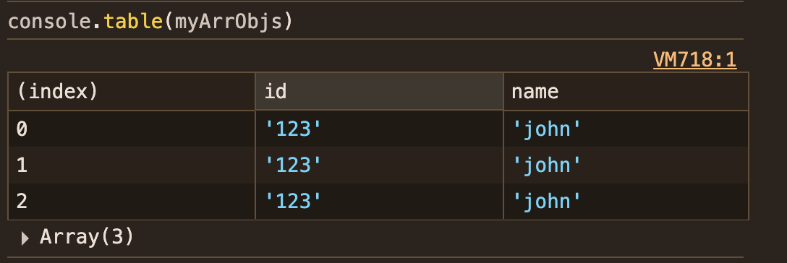
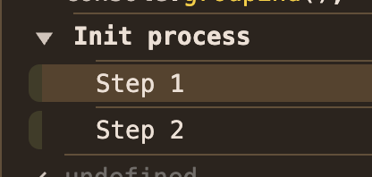
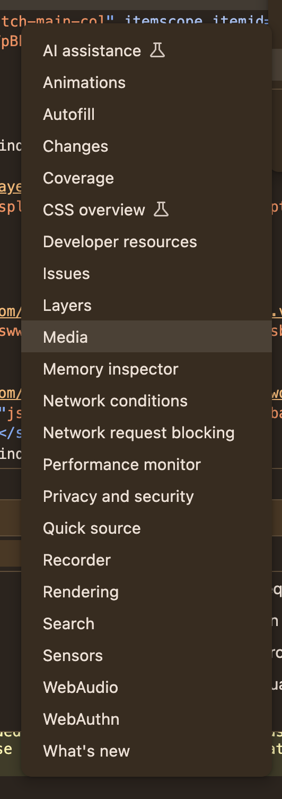

# Dev Tools

## 1. Fundamentals

### Settings

- You can setup:
  - Preferences: general browser preferences
  - Workspace
  - Experiments: Experimental features
  - Ignore list: Scripts to be ignored
  - Devices: Selecting different emulated devices
  - Throttling: Creating a specific network profile, such as: download/upload speed, latency, to simulate connections
  - Locations: Override geolocation coordinates
  - Shortcuts

### Elements

- HTML Body
- Inspect and live-edit the DOM and CSS
- Traverse HTML tree, tweak stules, attributes and layout

### Sources

- Debug and step through JS
- Set breakpoints, step, watch variables, and live-edit scripts

### Debugging

> Identifying the root of the problem and reproducing it, identifying ways to get rid of it

- Source panel

  - We can debug by line, or by `Event Listener Breakpoints`
  - Therefore, we can stop the code on events such as:
    - DOM Mutation
    - Keyboard events
    - Mouse events
      and many others

- We can add `debugger` to the JavaScript. It will stop execution when it gets there

1. Reproduce & Isolate

- Minimal, self-contained test case

2. Use DevTools Breakpoints

- Pause execution exactly where you need it
- Use "Pause on exceptions" to catch errors as they happen
- We can set `add breakpoints on condition`, then it will evaluate a boolean to identify whether or not to pause the code
- Breakpoints are also interesting to not only see, but also manipulate variables as the code runs.
  - We can check their value on console on that specific iteration
  - We can change their value on the `Sources/Scope`
- We can add breakpoints not only to JS on the `source` tab, but also to the DOM, on the `elements` tab
- We can also add to the console `debug(funcName)`. When this function is called, the breakpoint will kick in

3. If you add your workspace to the browser, the changes you do on the browser will be preserved on the files itself

- It changes the file system

4. You can store `Snippets` on the browser
   > Source/Snippets/New Snippet

#### Debugger

- Add `debugger` inside your code
- Buttons

  - Resume/Pause execution: runs the code until next debugger
  - Step over
  - Step in: steps in (function) from current level
  - Step out: takes to the next line after the function is called
  - Step: similar to `Step in`, but works slightly different with async code

- Options
  - Breakpoints
    - Pause on uncaught exceptions: quite interesting one to get errors we haven't treated
      - Good to deal with errors that are appearing, but we don't know where they're coming from
    - We can also add "breakpoints" on the lines we desire, this way we don't need to add `debugger` on the code
      - Interesting when we're debugging production code, which we wouldn't be able to modify the source code, but we might want to see what's happening in that context
  - Call Stack
    - We can see which function is calling which and their order
      - Last in, first out

### Network

- Interesting docs: https://developer.chrome.com/docs/devtools/network/reference/
- Monitor resource requests
- Inspect HTTP methods, headers, payloads, response codes, resource sizes, and load timing
- When clicking a resource, you get the following tabs:
  - headers: general, response, request
  - preview: structured output
  - response: raw output
  - initiator
  - timing: waterfall visualization of how long the request response took
  - cookies
- Tip: to save requests across page reloads, click `Preserve Log` checkbox on the network panel

#### Headers

- Click any resource to open the headers tab. It's organized into:

1. General

- Request URL: full endpoint (including query-string)
- Request Method: GET, POST, etc
- Status code + text: 200 OK, 404 Not Found
- Remote addres and Referrer Policy

2. Response Headers: Server sent metada about the payload

- Content-Type: MIME Type => text/html, images etc
- Content-Length
- Cache-Control, Expires
- CORS
- Security

3. Request Headers: What the client (your browser) sent

- Host, User-Agent, Accept, Accept-Encoding
- Authentication: Authorization, Cookie
- Custom headers: e.g. `X-CSRF-Token`, `X-Requested-With`

4. Query String Parameters: Lists `?key=value` pairs parsed out of the URL

5. Request Payload / Form Data

- Form Data: key-value form submissions
- Payload: raw JSON, text or binary bodies

#### Preview

Formatted view (JSON, HTML, imag..)

#### Response

raw server output

### Console

- Execute JS code
- View logs, warnings and errors

#### Types of console

Logging levels: They basically do the same, more or less -> console...

- .debug(): low-prioririty debug messages. They don't appears unless we set `Verbose`
- .info(): informational message. Usually styled with `i` icon
- .warn(): yellow-highlighted
- .error(): red-highlighted. Also prints the stack track

Structure data: Way to dissect further objects and arrays

- .dir(obj): list's objects properties as a collapsible tree
- .table(arr): renders arrays or objects as a sortable table -> Really cool!
  

Miscellaneous:

- `console.time()`/ `.timeLog()` / `.timeEnd()`: Measure duration between calls

```js
console.time("dbQuery");
// run query
console.timeLog("dbQuery"); // it brings the time in ms
console.timeEnd("dbQuery");
```

- `console.group()`/ `.groupCollapsed()` / `.groupEnd()`: Nest logs into expandable groups

```js
console.group("Init process");
console.log("Step 1");
console.log("Step 2");
console.groupEnd();
```

- `console.assert()`: Log an error only if the assertion is false

```js
const user = {
  isAdmin: false, // if it were true...
};

// Assertion failed: user must be admin to access this
console.assert(user.isAdmin, "user must be admin to access this"); //... this'd return as undefined
```



### Performance

- Analyize: CPU usage, rendering, scripting, painting, and layout breakdowns

### Memory

Interesting video: [Memory and Garbage Collection](https://www.youtube.com/watch?v=WqNqeMjd28I)

- Used to inspect and tamoe JS heap to find leaks or excessive allocations
- Track JS heap usage, take keap snapshots, detect memory leaks

  - Heap Snapshot: Capture JS heap at a point in time. Compares snapshots to find objects that shouldn't be retained (memory leaks)
  - They are are pretty much the same thing: they show memory allocation through time and application usage
    - Allocation instrumentation on timeline: Record allocations over time. Correlates spikes to user actions or code paths (more robust, more accurate)
    - Allocation Sampling: Profiling of where objects are allocated, shoing "hot" allocations sites without fullsnapshots (more lightweight, more simple)
  - Garbage collection: Manually triggers GC to see which objects get freed; useful alongside snapshots
  - Detached DOM nodes: Identify DOM nodes that have been removed from the document, but still remained in memory

  - Using the tools above, we can see if there's any value that is taking too much space, `Retained Size`

- It's better to do it on incognito tab

#### Garbage Collection

- The main concept of memory management in JS is `recheability`
  - "recheable" values are those that are accessible or usable somehow

```js
let user = {
  name: "john",
};

// <global> -> user -> Object name:"john"

// if the value of `user` is overwritten, the reference is lost

user = null;

// <global> -> user:null X then, this gets garbage collected >  Object name:"john"

// now, the content of our object { name: "john"} becomes unrecheable (no reference to it), garbage collector will clean it up
```

- JS automatically frees up memory by reclaiming cleaning up non-primitive values (objects, arrays, functions) that are no longer reacheable from a set of root references, such as:

  - global variables
  - call stack
  - DOM references

- Anything we can't access via some chain of references from those roots is considered garbage
- The basic garbage collection algorithm is called `mark-and-sweep`

### Application

- Manage client-side storage and state

  - Local storage/Session storage: read/write key-value pairs

    - Local storage: data is persistent, even after the browser is closed
      - Useful for: user preferences, application settings, and cached data
    - Session storage: data is cleared when browser/tab is closed
      - Useful for temp data that is only needed for the duration of the user's visit, such as: form data, shopping cart info

  - IndexedDB: Browser structured storage databases
  - Cookies: Inspect, modify or delete HTTP cookies

#### Local Storage and Session Storage methods

```js
.setItem(key, value); // store a string value
.getItem(key); // retrieve the value
.removeItem(key)
.clear() // wipes all the data
.length() // number of stored entries
```

### Lighthouse

- It does an audit of your website. It verifies:
  - Performance
  - Accessibility
  - Best practices
  - SEO

### More options

On the dev tools, go to menu beside the settings, where you can change the dock size, search open file, etc, and find `more tools`. There, you will be able to see a list of varied browser resources, such as:



- AI assistance: generate elements selectors, explain CSS rules, mock tests or code snippets
  - You need to turn on these features. Go to the settings, and turn what you need
- Animations: timeline settings for animations
- Autofill: Preview and trigger browser autofill data (addresses, credit cards, etc) on form fields
- Changes: tracks stylesheet/script edits in DevTools. Allows you to review and export the diff
- Coverage: Shows which CSS/JS is actually used on the pages vs. what you can trim to reduce bundle size
- CSS Overview: Sum up report on CSS: color palette, font usage, duplicated rules
- Developer resources: quick links to internal browser pages and specs
- Issues: centralized list of warnings, depcrecations, policy or security violations detected on the page
- Layers: visualize layers, which elements get GPU-accelerated and how they're stacked
- Media: inspect `video` `audio` elements
- Memory inspector: Low-level view of JS heap buffers (ArrayBuffers, TypedArrays) and raw memory layout
- Network conditions: Override user-agent strings, emulate offline or custom network latencies/bandwidth
- Network request blocking: Define URL patterns to block specific resources (ads, analytics, APIs) on the fly
- Performance monitor: Live charts for CPU usage, JS heap size, DOM node count (great for identifying spikes)
- Private and security: Inspect TLS certs, mixed-content issues, CORS errors and security/privacy settings
- Quick source: search source files by name without hunting through sources panel
- Recorder: Record user interactions as playback scripts or performance traceable flows -> really interesting
- Rendering: paint flashing, layer borders, FPS meter, and other visual overlays to debug rendering issues
- Search: Global text search across all loaded files and resources
- Sensors: Emulate geolocation, device orientation, touch support, and override the page's clock
- WebAudio: Graphical debugger for AudioContext: inspect nodes, parameters and real-time audio graph
- WebAuthn: Simulate WebAuthn (passkey) authenticator devices for testing login flows

## 2. Cool tricks

- Logpoints: Instead of adding `console.log()` to the code, you can:

  - Source > JS file > select the line > select `add logpoint` > select the message + value and it'll appear in the log
  - They persist across page reloads
  - `conditional breakpoint`: the code only pauses if certain condition is true

- CMD + SHIFT + P: Open the menu elements of the browser. Quite handy.

- Rendering tab: There are several cool features here, such as:

  - Layer nborder: showing the borders of your layouts
  - Scrolling performance issues
  - Preview website with different themes
  - and many more

- CSS Overview: Allows you yo have a sum up of the CSS

  - Useful for debugging, checking the colors profiles, contrast issues
  - How many font-sizes, font-weight, line-height are being used. Great for identifying issues with consistency

- Full page screenshot: Select the body element and select `take screenshot`

- Copy console: Instead of selecting and then copying the whole console, right click and select `copy console`

- Snippets: You can save custom JS on the browser through the Snippets.

  > sources > snippets > `new snippet`

  - it's like creating your own Chrome extension

- To clean cache: with the DevTools open, select reload, then there will be an option to clean the cache
