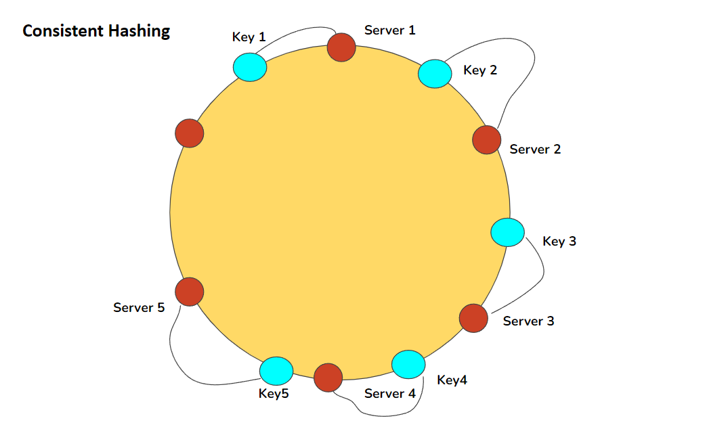
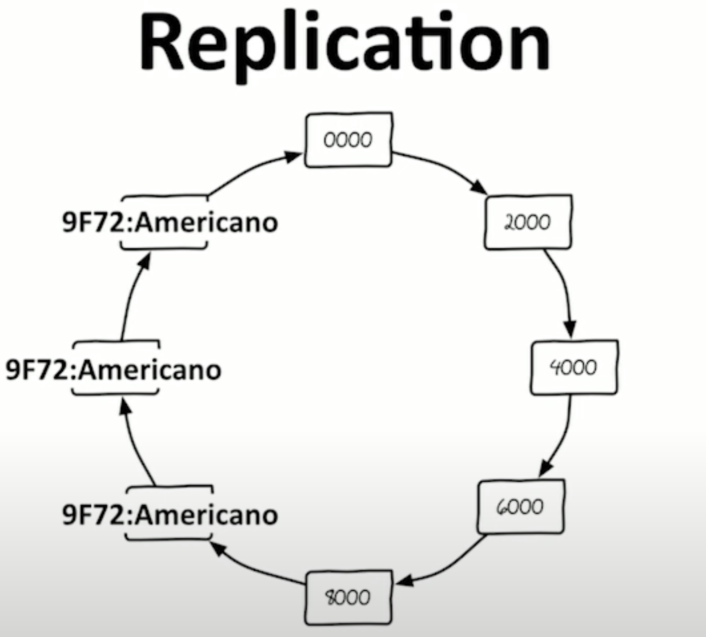

# Distributed Systems

- Collection of independent nodes (machines or processes) that collaborate over a network and behave as a single, coherent system
- Share resources and coordinate to perform tasks
  > A collection of independent computers that appear to its users as one computer. - Andrew Tannenbaum

### Characteristics

The computers...

- operate concurrently
- fail independently
- do not share a global clock

## Core Concepts

- Transparency: Hiding the distribution (location, replication) so clients see a unified interface
- Concurrency and parallelism: Multiple nodes execute tasks simultaneously.
  - Needs coordination to avoid conflicts
- Fault tolerance: Detecting and recovering from crashes, network partitions, or slow failures via: replication, heartbeats, timeouts
- Consistency models: Strong to eventual
  - Correctness / availability
- CAP Theorem: Consistency, Availability, Partition Tolerance. Pick 2.
- Consensus algorithm: Protocols like Paxos or Raft to a agree on a single value/state across unreliable nodes
- Replication & partitioning: Copying data across nodes (replicas) for durability, and sharding/partitioning for scale
- Time & Sync: Logical clocks (Lamport), vector clocks, or physical clocks to order events
- Communication: RPC (gRPC), message passing (Kafka, RabbitMQ), idempotent APIs, back-off and retry
- Scalability & Load balancing: Horizontal vs. Vertical
  - Distributing traffic
- Observability: Distributed tracing, centralized logging, metrics (latency, error rates)

## Key tech

- RPC & APIs: gRPC, Apache Thrift, REST/GraphQL over HTTP/2
- Messaging & Streaming: Apache Kafka, RabbitMQ, NATS
- Coordination services: Apache ZooKeeper, etcd, HashiCorp Consul
- Distributed datastores: Cassandra, CockroachDB, MongoDB, Amazon DynamoDB
- Containerization & Orchestration: Docker, K8s, Docker Swarm
- Service mesh & load balancing: NGINX, Istio, Linkerd
- Monitoring & tracing: Prometheus, Grafana, Jaeger

## 3 Areas of distributed systems

### Storage

1. Single-Master storage: A db that exists on a single server

- Normally, there are more reads than writes

2. Read replication

- Eventually consistent db

3. Sharding

- Breaking the db into keys (username, location, etc)
- This causes the db to become completely independent

#### Consistent Hashing

- Non-relational dbs normally follow this concept
- Technique for distributing keys across a dynamic set of nodes
  - Minimal remapping is needed when nodes join/leave

- It can also be useful for "replicating" the data through the nodes. e.g., the item can be saved on its node and the next two
  

  - But then, we get consistency problems. We get 3 copies of 3 things that can change in 3 computers

    - Write: we can "demand" that 1/2 node(s) save the information, otherwise we consider it a failure
    - Readt: we can "demand" that 1/2 node(s) retrieve the information, otherwise we consider it a failure

    > Formula: R + W > N

    - Where:

      - R: number of nodes I read
      - W: number of nodes I write
      - N: number of nodes/replicas

      If R + W > N, then I have strong consistency

      - If read 1 and write 1 and 3 replicas -> eventual consistency
      - If read 2 and write 2 and 3 replicats -> strong consistency

##### How it works

1. Hash ring

   - Map the hash space onto a virtual ring
   - Each node is assigned one (or more) position(s) on the ring by hashing its identifier
     - node1: 1
     - node2: 10
     - node3: 100

2. Key assignment

   - Given the key's hash, we move "clockwise" on the ring until we find the first node that "owns" the key.
     - key1: 1b -> goes to node1
     - key2: 54c -> goes to node3

3. Node change
   - Adding a node: it occupies new points on the ring.
     - Only keys between itself and its predecessor are reassigned
   - Removing a node: its keys move to its successor

#### CAP Theorem

- Consistency: if I read something, it should be the most updated
- Available: if I try to read it works, if I try to write it works
- Partition tolerance: if I wrote something, and part of the system failed, it still should save what I wrote

  - System ability's to continue working even when communication between nodes fails

- When a partition (error) happens, we must pick either:
  - CP: refuse some reads/writes to stay consistent (sacrifice availability)
  - AP: server all request but risk returning stale data (sacrifice consistency)

### Computation

- Hadoop

  - Map/Reduce
  - Considered legacy today

- Spark

  - Scatter/gather paradigm (similar to MapReduce)
  - More general data model (RDDs, DataSets)
  - More general programming model (transform/action)
  - Storage agnostic

- Kafka
  - Focus o real-time analysis, not batch jobs
  - Streams and streams only
  - Except streams are also tables (sometimes)
  - No cluster required

### Messaging
