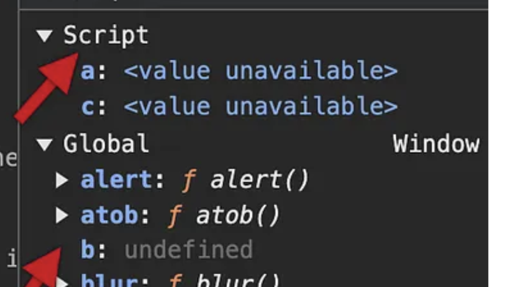
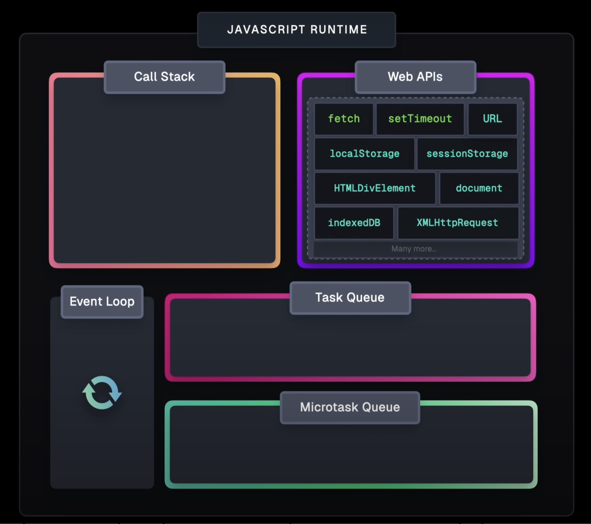

# JavaScript

1. Scope
   1.1 var and const
   1.2 hoisting
2. Closure
3. Event Loop
4. Promises
5. Module System

## 1. Scope

- Determines where you can access (read or write a variable)
- They are: global, function, block
- Before ES6 (2015), JS variables had only Global and Function Scope `var`. With the introduction of `const` and `let`, block scope was added

  - `var` variables don't accept block scope

  ```js
  {
    let x = 2;
  }

  // x CAN'T be used here -> let/const (block scope)

  {
    var x = 2;
  }

  // x CAN be used here -> var (no-block scope)
  ```

- Global: anything declared outside a function or block lives on the global object (in browsers, `window`)
  - `var`, `let`, and `const`: behave similar when declared globally. They all have global scope

```js
const x = 10; // global

function foo() {
  console.log(x); // reading the gloal
}

foo();
console.log(x); // 10
```

- Function: variables declared inside a function are LOCAL to that function. They don't exist outside

  - Local variables are created when a function starts, and deleted when it's completed
  - `var`, `let`, and `const`: behave similar when declared inside a function. They all have function scope

```js
function bar() {
  const y = 5;
  console.log(y); // local scope
}

bar();
console.log(y); // ReferenceError: y is not defined
```

- Block: with ES6, `let` and const`are scope to the nearest`{...}` block (if, loop, etc)

```js
{
  let a = 1;
  const b = 2;
  console.log(a, b); // 1 2
}

console.log(a, b); // ReferenceError: a is not defined
```

```js
let outerVar = "outer scope"; // module scope

function exampleFunction() {
  let middleVar = "middle scope";

  if (middleVar) {
    let innerVar = "inner scope";

    console.log(innerVar);
  }

  console.log(middleVar);

  return function enclosingEverything() {
    return [middleVar, outerVar];
  };
}

exampleFunction();
/*
output:
inner scope
middle scope
ƒ enclosingEverything() {
    return [middleVar, outerVar];
  }
*/
```

### 1.1. let vs const

- both are block scoped and unavaible before their declaration (the "TDZ" - temporal dead zone)

```js
{
  console.log(z); // ReferenceError
  let z = 3;
}
```

#### `let` -> binding mutable

1. can be reassigned

```js
let a = 1;
a = 2; // ok
a = "hey"; // ok
```

2. can be declared without initial value

```js
let x;
x = 10;
```

#### `const` -> binding immutable

Once a variable is declared with const, it becomes "read-only" (if primitive, arrays and objects can still have its inner values changed)

1. can't be reassigned

```js
const a = 1;
a = 2; // TypeError
```

2. must be declared with initial value

```js
const x; // SyntaxError
const x = 10; //ok
```

3. A `const` binding can't change, but the value it points to can (mutating objects and arrays)
   - binding: link between name (identifier) and the value it refers to in memory
   - with const, binding is permanent. Once you do `const foo = 42`, you can't `foo = 99`
     - Basically, after a variable is declared with `const`, it becomes `read-only`
   - However, it doesn't mean the underlying values (properties is fronzen), only the name between name->value is. Thus, it's an object or array, you can still mutate its content

```js
const obj = { v: 1 };
obj.v = 2; // property mutation allowed
obj = {}; // cannot rebind
```

## 1.2. Hoisting

- Mechanism by which variable and function declarations are moved ("hoisted") to the top of their containing scope before code execution

### Function

- Entire function bodies are hoisted

```js
// we can call before its declaration
sayHello(); // "hello"

function sayHello() {
  console.log("hello");
}
```

### var

- Only the declaration (not the initialization) is hoisted.
- Variable is initialized to `undefined`

```js
console.log(count); // undefined, not ReferenceError
var count = 5;
console.log(count); // 5

// basically, it's the same as
var count;
console.log(count); // undefined
count = 5;
console.log(count); // 5
```

### let and const

- They are hoisted in concept, but reside in a Temporal Dead Zone (TDZ) until their line of declaration
- Accessing them before declaration throws a `ReferenceError`

```js
console.log(x); // ReferenceError: can't access 'x' before initialization
let x = 10;

console.log(y); // ReferenceError
const x = 10;
```

## 1.3 Temporal Dead Zone

- Period during which a variable is declared but cannot be accessed
- From the start of the block scope until the variable is initialized
- Exists to prevent potential bugs caused by premature access
- `var`, `let` and `const` are hoisted, but `let` and `const` behave differently

  - `var`: stored in the global object. Can be accessed before initialization, but with `undefined` value
  - `let` and `const`: stored in the script or TDZ

- It was created to enforce safer coding practices
  

## 2. Closure

- Gives a function access to its outer scope
- In JS, we have access to the to "upward" scope. The grandchild has access to the parent and grandparent scope

```js
const name = "Matt";

function printName() {
  // we're using a variable from outside the function here
  // name variable, even though declared outside, is available within the function scope
  console.log(name);
}

printName(); // it will always get the most recent value of that variable
```

```js
function outerFunc(outerVariable) {
  return function innerFunc(innerVariable) {
    console.log("outer variable", outerVariable); // it "saves" the outer variable, even if the function `outerFunc` has finished executing
    console.log("inner variable", innerVariable);
  };
}

const newFunction = outerFunc("outside"); // we call the function and "save" the innerFunc reference by saving it to a variable on the outside scope (not garbage-collected)
newFunction("inside"); // we get the inner func

// outer variable outside
// inner variable inside
```

## 3. Execution Contexts

- The environment in which JavaScript code is executed
- It's an abstract "container" that holds everything needed to evaluate and execute the code
- Types:
  - 1. Global context
    - created once the script loads
    - Its variable object is the `global` (in browsers, `window`)
  - 2. Function context
    - created when a function is invoked
    - each call gets its own context
  - 3. Eval context (rare)
    - created when you execute `eval(...)`
  - 4. Block context (ES6+)
    - create for `{...}` when you use `let`/`const`

### Lifecycle

1. Creation phase: Sets up the environment for the code to be executed

- Variable object (VO): Contains all variables and functions that are defined in the current scope

  - Function arguments, function declarations, and variable declarations
  - Used to resolve identifiers to their values during execution

- Scope chain: list of variable objects that are accessible in the current scope

2. Execution phase: JS executes the code line by line

- Code runs line by line
- Variables get assigned
- Functions execute

## 4. Event Loop

- Let's a single-threaded runtime handle async tasks non-blockingly
- Since JS is single-threaded, long tasks can't block it. So, we use the "event loop" to offload the thread
- The event loop, itself, is part of the ecosystem of mechanisms that JS has to handle "concurrent/async" tasks, even though it's single-threaded
  - 1. Call stack: where the sync code runs
  - 2. Task queues:
    - Macrotask queue (aka, "callback queue"): setTimeout, DOM events, I/O callbacks
    - Microtask: promise-callbacks (then/catch), queueMicroTask, MutationObserver
  - 3. Event Loop
    - Checks if the call stack is empty, if it is, it:
      - checks if the microtask has any task. In case yes, it sends to the call stack. If no, it checks the macrotasks

```js
console.log("start");

setTimeout(() => console.log("timeout"), 0);

Promise.resolve().then(() => console.log("promise"));

console.log("end");

/* 
output
start
end
promise -> microtask -> runs when callstack is empty
timeout -> macrotask -> runs only after the callstack and microtasks are empty
*/
```

1. Every time we call a function, we throw it into the call stack (LIFO)
2. Once the task has finished processing, it's added to the queue (FIFO) and once the call stack is free, it will be added there.
   - Meanwhile, it "sits" there, waiting.

## 5. JavaScript Runtime

Composed of:

- JavaScript Engine
  - Call stack
  - Heap
- Event loop
- Web APIs
- Task queue (aka, MacroTask Queue)
- Microtask queue
  

```js
console.log("one"); // 1

console.log("one"); // 2

function log3() {
  console.log("three"); //5
}

function log3and4() {
  log3(); //4
  console.log("four"); //6
}

log3and4(); //3
```

```js
Promise.resolve().then(() => console.log(1));

setTimeout(() => console.log(2), 10);

// queueMicrotask: method of the `window` interface
queueMicrotask(() => {
  console.log(3);
  queueMicrotask(() => {
    console.log(4);
  });
});

console.log(5);
```
